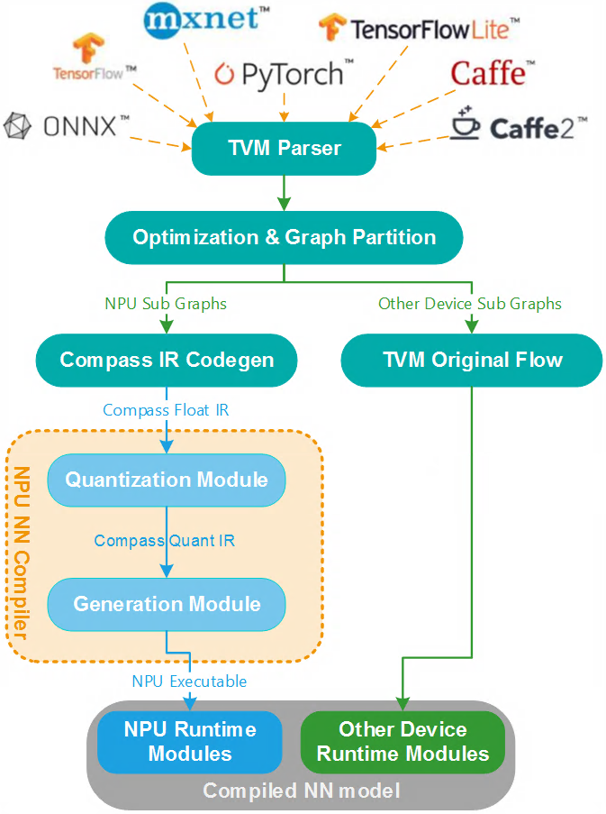

<!---SPDX-License-Identifier: Apache-2.0-->
<!---Copyright (c) 2023-2024 Arm Technology (China) Co. Ltd.-->

# Compass Apache TVM

[中文版本](../README.osc.md)

The [Apache TVM](https://tvm.apache.org/) is an open-source machine learning compiler framework for CPUs, GPUs, and accelerators. It aims to enable machine learning engineers to optimize and run computations efficiently on any hardware backend.

**The Zhouyi Compass is integrated with the Apache TVM for Neural Network (NN) model quick support and heterogeneous execution**. Through the Zhouyi Compass integration with the Apache TVM, your NN model can be supported quickly even though the NN compiler of the Zhouyi Compass does not support the ML framework of the NN model yet.

## Graph Partition and Heterogeneous Execution

**The graph partition solution** is based on the Apache TVM Bring Your Own Codegen (BYOC) framework. It splits the NN operators that the Zhouyi NPU supports and forms the NPU sub graphs. The remaining operators form sub graphs corresponding to the specific device supported.

The runtime will execute the compiled NN model heterogeneously and automatically. **Heterogeneous execution** of the compiled NN model is transparent to the user application logic. The **compiled NN model consists of several Apache TVM runtime modules**, which include multiple **NPU runtime modules, CPU runtime modules, and other device runtime modules**. The output is obtained when the input data flows over all runtime modules. The data movement between different devices is handled by the Apache TVM runtime automatically.

## Usage Workflow

The workflow of using the Apache TVM contains two parts: compilation and execution.

The compilation part always runs on the host development environment. The compilation part includes:

- Partitioning the NN model to several sub graphs.
- Processing the NPU sub graphs through the NPU NN compiler of the Zhouyi Compass.
- Combining results of all sub graphs together through the Apache TVM runtime execution mechanism.

**The result of compilation is a deployable object**: The object not only can be exported and deployed to the device user environment, but also can be run directly in the host development environment by the Zhouyi NPU simulator.

All work of the execution part is handled by `class ExecutionEngine`. It hides the details of the specific executor (for example, graph executor or VM), so that the execution part code is the same regardless of which executor is used when compiling the NN model.

The execution process can not only be run locally in the Simulator, but can also be conveniently executed on remote real devices through RPC. With RPC, all other parts except the compiled NN model are executed in the host development environment, so the complex preprocess or postprocess can be implemented easily.

## Supported Features

- Support for various models and operators
  - 120+ models
  - 130+ Relay OP
  - Quantized models
  - PyTorch & ONNX QAT models
- Support for automatic partition of NPU subgraphs
- Support for heterogeneous execution of NPU, CPU and others
- Support for Linux, QNX, and Android OS deployments
- Easy switch between Simulator and RPC remote hardware operations
- Unified interface support for switching Graph Executor or VM without modifying code
- Release package
  - Binary encryption distribution package
  - Source code release package
  - Out of box example
- User Guide, API, and source level developer documentation
- Support for Bare Metal scenarios
- Support for custom operators across the full link from the Relay front-end to the NPU
- Quarterly synchronization with the latest official release

## Development Guide

To learn about how to build from scratch, read the following development guide:

- [Source Development Guide](../aipu/docs/source_development_guide.md)

## More Materials

To learn about other useful functions of the project, refer to the following materials:

- [Remote Procedure Call](../aipu/docs/rpc.md)
- [Frequently Questioned Answers](../aipu/docs/fqa.md)
- [Supporting Bare Metal](../aipu/docs/supporting_bare_metal.md)
- [Compass Pipeline](../aipu/docs/pipeline.md)