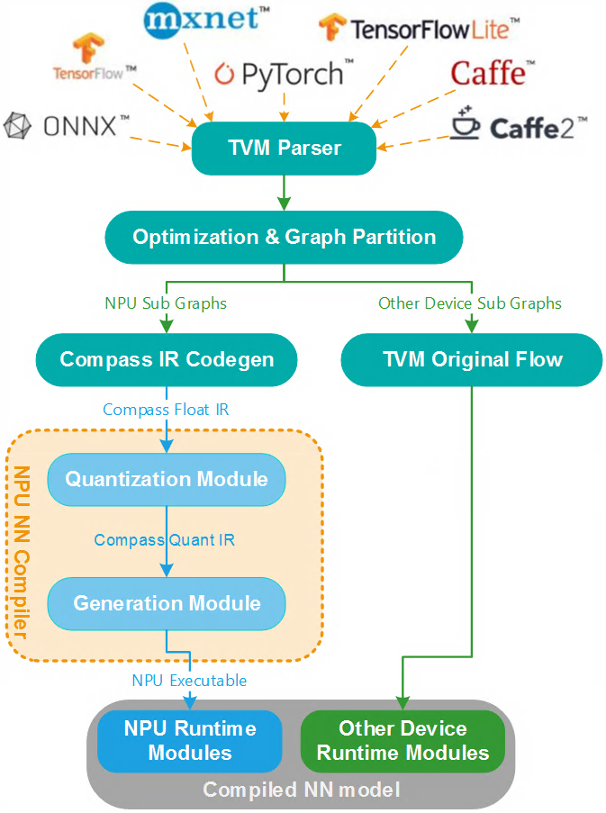

<!---SPDX-License-Identifier: Apache-2.0-->
<!---Copyright (c) 2023 Arm Technology (China) Co. Ltd.-->

# Compass Apache TVM

[English Version](.github/README.md)

[Apache TVM](https://github.com/apache/tvm) 是一个用于CPU、GPU和加速器的开源机器学习编译器框架。它旨在使机器学习工程师能够在任何硬件后端高效地优化和运行计算。

Zhouyi Compass与Apache TVM集成，用于神经网络（NN）模型的快速支持和异构执行。借助Apache TVM的强大Parser，即使Zhouyi Compass的NN编译器不支持特定框架格式的模型，也可以快速支持您的NN模型。

## 图切分与异构执行

模型图切分方案基于Apache TVM Bring Your Own Codegen（BYOC）框架。它对周易NPU支持的NN算子进行了拆分，形成了NPU子图。剩下的算子形成与特定设备支持的子图。

运行时异构自动地执行编译后的NN模型对用户应用程序而言，其逻辑是透明的。编译的NN模型由几个Apache TVM运行时模块组成，其中包括多个NPU运行时模块、CPU运行时模块和其他设备运行时模块。当输入数据流经所有运行时模块，得到输出。不同设备之间的数据移动由Apache TVM运行时自动处理。

## 使用流程

使用ApacheTVM的工作流程包括两个部分：编译和执行。

编译部分始终在主机开发环境中运行。编译部分包含：

- 将神经网络模型划分为几个子图。
- 通过Zhouyi Compass的NPU-NN编译器对NPU子图进行处理。
- 通过Apache TVM运行时执行机制将所有子图的结果组合在一起。

编译的结果是一个可部署的对象：该对象不仅可以导出并部署到设备用户环境中，而且可以通过周易NPU模拟器直接在主机开发环境中运行。

执行部分的所有工作都由“类ExecutionEngine”处理。它隐藏了具体的执行器（例如，图形执行器或VM）详细信息，因此无论在编译NN模型时使用哪个执行器，执行部分代码都是相同的。

执行过程不仅可以在模拟器中本地运行，还可以通过RPC在远程真实设备上方便地执行。通过RPC，除了编译的NN模型外，所有其他部分都在主机开发环境中执行，可轻松实现复杂的预处理或后处理。

## 支持特性

- 支持模型和算子
  - 120+模型
  - 130+Relay算子
  - 量化模型
  - PyTorch和ONNX QAT模型
- 支持NPU子图的自动划分
- 支持NPU、CPU等异构设备执行
- 支持Linux、QNX和Android操作系统部署
- 可在模拟器或RPC远程硬件操作之间轻松切换
- 提供统一接口支持Graph和VM的执行器切换，且无需修改代码
- 发布包
  - 二进制加密版本包
  - 源代码发布包
  - 开箱即用的示例
- 提供用户指南、API和源代码级开发人员文档
- 支持裸机场景
- 支持用户自定义算子及从Relay前端到NPU的全链路支持
- 支持与最新官方发布版本进行季度同步

## 开发指引

下面是开发指引，您可以了解到如何从头以源码构建项目等。

- [Source Development Guide](aipu/docs/source_development_guide.md)

## 更多材料

以下是材料，您可以了解该项目的其它有用功能。

- [Remote Procedure Call](aipu/docs/rpc.md)
- [Frequently Questioned Answers](aipu/docs/fqa.md)
- [Supporting Bare Metal](aipu/docs/supporting_bare_metal.md)
- [Compass Pipeline](aipu/docs/pipeline.md)
