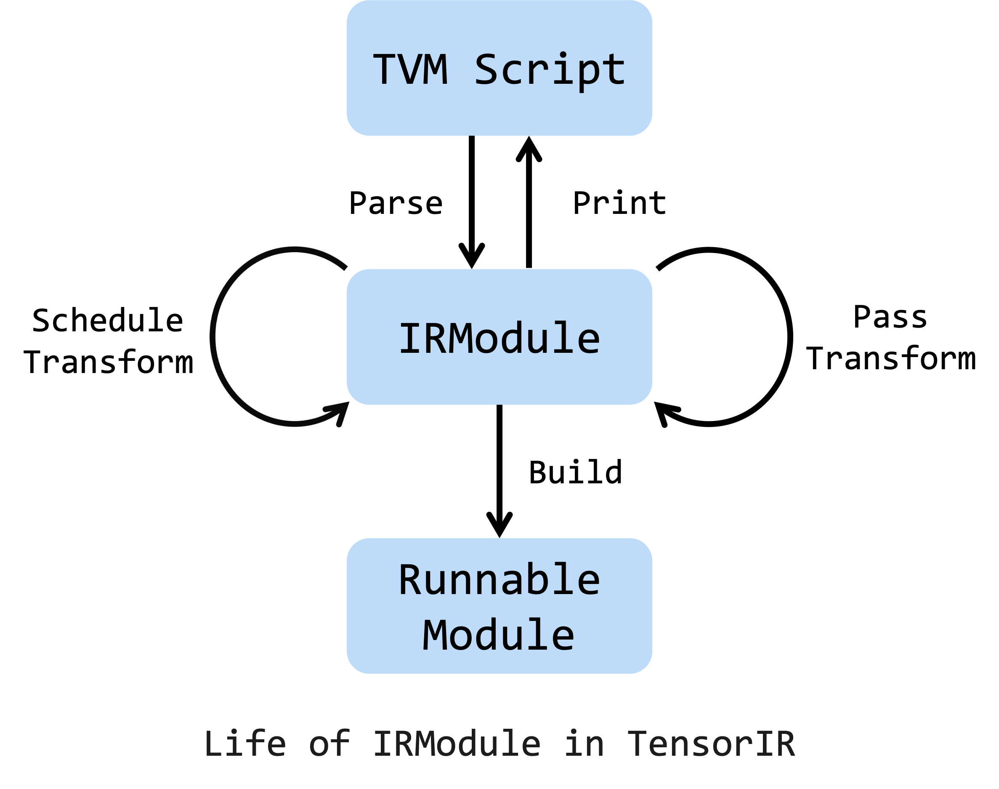
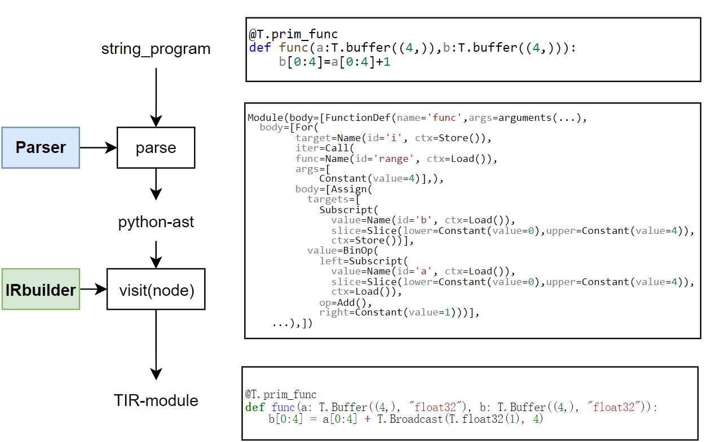

<!---SPDX-License-Identifier: Apache-2.0-->
<!---Copyright (c) 2023-2024 Arm Technology (China) Co. Ltd.-->

# Compass DSL

Compass DSL is developed based on the TVM Script. Here is the outline of this section:

- TVM Script Overview
- From TVM Script to IRModule
- Compass DSL Language
- AIPU built in
- Compass DSL vs. TVM Script

## TVM Script Overview

Here is a figure from the TVM Documentation. The TVM Script will be parsed into IRModule, then several pass transformations/schedule transformations can be applied on IRModule, and finally the IRModule is built into an executable module.



## TVM Script to IRModule
This section shows how the TVM Script is converted to a TIR Module.



All user-written TVM Script/Compass DSL should be with the decorator `@T.prim_func/@S.prim_func`. Scripts are only Python string source code. In the parsing phase, the parser analyzes the string program and generates the Python AST. The Python AST is then run through with the help of Visitor Pattern and each node is converted into TentorIR structures with IRBuilder.

## Compass DSL Language
Compass DSL is a statically typed subset of Python, so many Python features can apply directly to Compass DSL.

- dtype
- dtype cast
- mask
- variable (define, update, access)
- expr
  - unaryOp
  - binaryOp
  - call
  - subscript
  - slice
- stmt
  - return
  - assign
  - for, while
  - if
  - with
- function def, func call
- primfunc
- buffer, ptr:
  - ptr
  - alloc_buffer
  - match_buffer

See the [Language Basics](../language_basics/index.rst) for more details.

## API Design Principles

### Mask
Mask is widely used in Compass DSL, which means that simplicity and universality must be combined
when considering its design.

Mask accepts the following types:
- None: All elements are active.
- Array[bool]: From low to high, elements that are True are active. Insufficient values are automatically filled with False.
- PrimExpr: The variable masks which value can be determined at runtime. Must be a bool vector.
- str(Recommend): [String Representation](../how_to_guides/how_to_use_mask.md#string-representation)

### Parameter Type
In the Compass ISA, many instructions have multiple parameter types, such as add.ss, add.su, add.uu.

When designing, in order to reduce the burden on users and avoid having to remember various
different instruction forms, we removed these parameters from the interface. But there is a problem.
If one parameter is a signed number and the other is an unsigned number, the output type cannot be
determined. Therefore, the out_sign parameter is introduced.

The general principle is that users only need to think about what they want to do, and leave the
selection of instructions to the Compass DSL compiler.

### Auto Broadcast
To simplify user usage, all vector interfaces support automatic broadcasting.

So you can use scalar directly on the interface without creating a vector in advance, and you do not
need to use vbcast to manually broadcast scalar variables.

### Concise vector intrinsic APIs
Compass has many intrinsic with similar semantics, which are simplified into the same interface in
DSL and controlled by parameters to reduce the user's usage burden.

Here are some examples:
- Combine int and its corresponding float version.
- 20+ nsr -> 1 API with 4 parameter + 1 high frequency alias.
- vasr, vasrr, vlsr, vlsrr -> vsr.
- vsxtl, vuxtl -> vxtl.
- vload, vload_stride -> vload.

## Compass DSL vs. TVM Script

### TIR in Script
- TVM Script: &#10004;
- Compass DSL: &#10004;

Compass DSL can reuse TVM Script TIR:
```
T.exp              S.exp
T.grid             S.grid
T.vectorized       S.vectorized
T.max              S.max
T.alloc_buffer     S.alloc_buffer
...
```
For more information about TIR API in Script, see `python/tvm/script/ir_builder/tir/ir.py` and `python/tvm/aipu/script/ir/ir.py`.

### Subroutine Call
- TVM Script: &#10006;
- Compass DSL: &#10004;

The TVM Script does not support primfunc subroutine call. If you write the code like this, it will raise an error:
```py
@T.prim_func
def subfunc(...):
  xxx

@T.prim_func
def func(...):
  subfunc(...) # error: 'PrimFunc' object is not callable
```
Compass DSL supports subroutine call. During the parse stage, it analyzes the function with its callees. Then in module building stage, kernel function (main function) and subroutine functions are added into the module. Here is a sample code:
```py
@S.prim_func
def subfunc(a: S.ptr("int32", "global"),b: S.ptr("int32", "global")):
    b[0] = a[0] + 1

@S.prim_func
def func(a: S.ptr("int32", "global"),b: S.ptr("int32", "global")):
    subfunc(a,b)
```
The genereted c_code is:
```c
__kernel void func(__global int* a, __global int* b);
void subfunc(__global int* a, __global int* b);

__kernel void func(__global int* a, __global int* b) {
  subfunc(a, b);
}

void subfunc(__global int* a, __global int* b) {
  b[0] = (a[0] + 1);
}
```
### Macro
- TVM Script: &#10004;
- Compass DSL: &#10004;, but pysim does not support macro &#10006;

The macro is similar to C preprocessor.

The macro would never have any actual calls generated to the PrimFunc body. Instead, they would be pasted (inlined) into TIR.

For macro call `macro_name(arg1, arg2, arg3, ...)`, the values are substituted into the body of the macro, and the body with the substituted values is then inserted at the point where the call is located.

Here is an exmaple of macro with static symbol capture.
```py
  n = 8

  @S.macro
  def add_func(inp, out, idx):
      out[idx] = inp[idx] + n

  @S.prim_func
  def func(a: S.ptr("i32", "global"), b: S.ptr("i32", "global"), n: S.i32):
      if n > 0:
          add_func(a, b, 0)
      else:
          add_func(a, b, 1)
```
The generated code is:
```c
__kernel void func(__global int* a, __global int* b, int n) {
    if (0 < n) {
        b[0] = (a[0] + 8);
    } else {
        b[1] = (a[1] + 8);
    }
}
```
