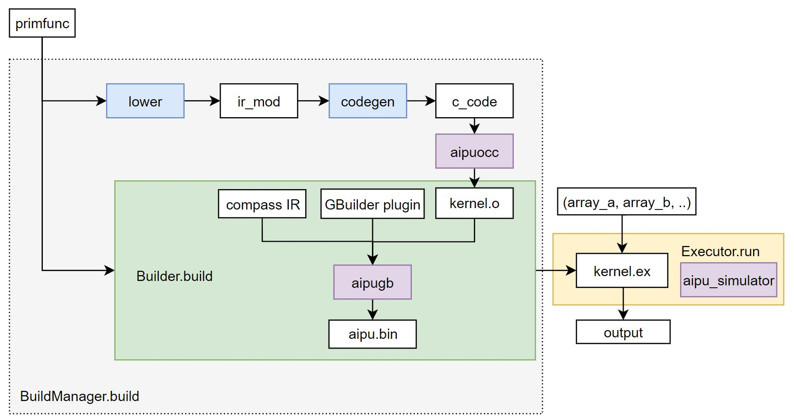

<!---SPDX-License-Identifier: Apache-2.0-->
<!---Copyright (c) 2023-2024 Arm Technology (China) Co. Ltd.-->

# Build and Run Workflow
This tutorial explains the build workflow of Compass DSL.
- What is BuildManager?
- What happens in lowering stage?
- What happens in Codegen stage?
- What is Builder?
- What is Executor?

Here is a simple example that shows how to use API to build and run the primfunc.
```py
import numpy as np
from tvm import aipu
from tvm.aipu import script as S

dtype = "int32"
n = 8

@S.prim_func
def func(a: S.ptr(dtype, "global"), b: S.ptr(dtype, "global")):
    va = S.vload(a)
    vb = S.vadd(va, 1)
    S.vstore(vb, b)


def test_func():
    bm = aipu.tir.BuildManager(target="X2_1204")  # What is BuildManager?
    ex = bm.build(func)                           # What is the build workflow?
    print(ex.c_code)                              # How Codegen works?

    a = np.array(list(range(n)), dtype=dtype)
    aipu_out = np.zeros((n,), dtype=dtype)
    ex(a, aipu_out)                            # What is Executor?
    print(a, aipu_out)


if __name__ == "__main__":
    test_func()
```
## General Build Workflow



The general build workflow is:
1. The primfunc function will be first lowered to a IR_Module.
2. The IR_Module will go through the codegen and generate the c_code.
3. The AIPU compiler will compile the c_code into an object file.
4. The builder.build will generate the compass_ir, and gbuilder_plugin with the primfunc_info, then call the aipugb to generate the aipu.bin.
5. The executor function is a runtime-module, which can be called directly with runtime arguments, run and get the outputs.

## BuildManager
```py
bm = aipu.tir.BuildManager(target="X2_1204")
```
The AIPU buildmanger is a user interface for DSL program compilation.

To declare a buildmanger, the `target` is required. The default target is **"X2_1204"**.

You can then call the `lower` or `build` method of bm:
```py
mod = bm.lower(primfunc)
ex = bm.build(primfunc)
```
## Lower
    lowering: transform a program to a lower-level representation that is closer to the target.

In the lower stage:

1. Turn the input (`Union[tvm.te.Schedule, tvm.tir.PrimFunc, IRModule]`) into IR_Module.
2. Run a sequence of passes(transformations). Many of the transformations in lowering stage are **target independent**.

    It also allows to configure transformation parameters before applying transformations.

## Codegen

In the codegen stage,

1. Apply some **target dependent** passes(transformations).

2. Call the Codegen Module to translate the IR_Module into string c_code.

## Builder
The Builder is responsible for building the DSL program during execution.

In the Builder.build stage:
1. Generate the compass_ir with primfunc_info
2. Generate the gbuilder op_plugin
3. Call aipugb to generate aipu.bin
4. Return the runtime_module

## Executor
Executor is responsible for executing the DSL program.
The main feature of executor is that it has the '__call__' method, which means that it is callable.

In the Executor.run stage:
1. Get the executable packed function.
2. Convert the runtime input arguments from `np.array` into `tvm.nd.array`.
3. Run the compiled DSL program.
4. Convert the outputs from `tvm.nd.array` to `np.array`.
