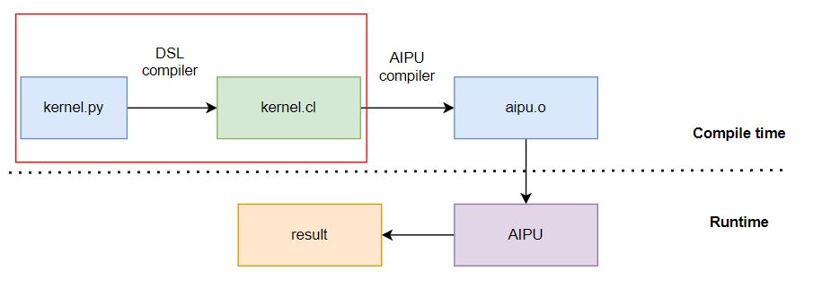

<!---SPDX-License-Identifier: Apache-2.0-->
<!---Copyright (c) 2023-2024 Arm Technology (China) Co. Ltd.-->

# Introduction

## What is DSL?

A Domain Specific Language (DSL) is a computer language specialized to a particular application domain.

## What is Compass DSL?

Compass DSL is a Python programming language for AIPU general tensor computations in the context of Artificial Intelligence (AI).

Compass DSL is a user-friendly programming language for Zhouyi NPU hardware series. Compass DSL aims to bridge the gap between high-level operators in DL frameworks and Zhouyi NPU’s low level kernel implementations with high performance. With AIPU Python DSL, developers can write code that efficiently utilizes the capabilities of the Zhouyi NPU hardware.

## Feature List

- Simple and highly maintainable: [flexible width and multiple width vector](../language_basics/flexible_width_and_multiple_width_vector.md)
- Easy to run and [profile](../how_to_guides/how_to_use_profiler.md) on device through [RPC](../how_to_guides/how_to_use_rpc.md)
- Easy to [debug](../how_to_guides/how_to_debug_with_python.md) through [PySim](../explanation/pysim.md)
- [Interact with powerful Python ecosystem](../how_to_guides/how_to_interact_with_python.md)

## Workflow

The Compass DSL workflow is shown as follows:




## A Simple Code of Compass DSL

Here is a simple example
```py
from tvm.aipu import script as S
from tvm import aipu


dtype = "float32"
n = 1024

@S.prim_func
def func_add(a: S.ptr(dtype, "global"), b: S.ptr(dtype, "global"), c: S.ptr(dtype, "global"), n: S.int32):
    for i in range(n):
        c[i] = a[i] + b[i]

bm = aipu.tir.BuildManager(target="X2_1204")
ex = bm.build(func_add)
print(ex.c_code)

```
The generated OpenCL code will be
```c
__kernel void func_add(__global float* a, __global float* b, __global float* c, int n) {
  for (int i = 0; i < n; ++i) {
    c[i] = (a[i] + b[i]);
  }
}
```

This is a simple demo, which shows the Python code being converted into OpenCL kernel code, without any optimization. For further information, please see the **tutorials** and **how-to guides**.
