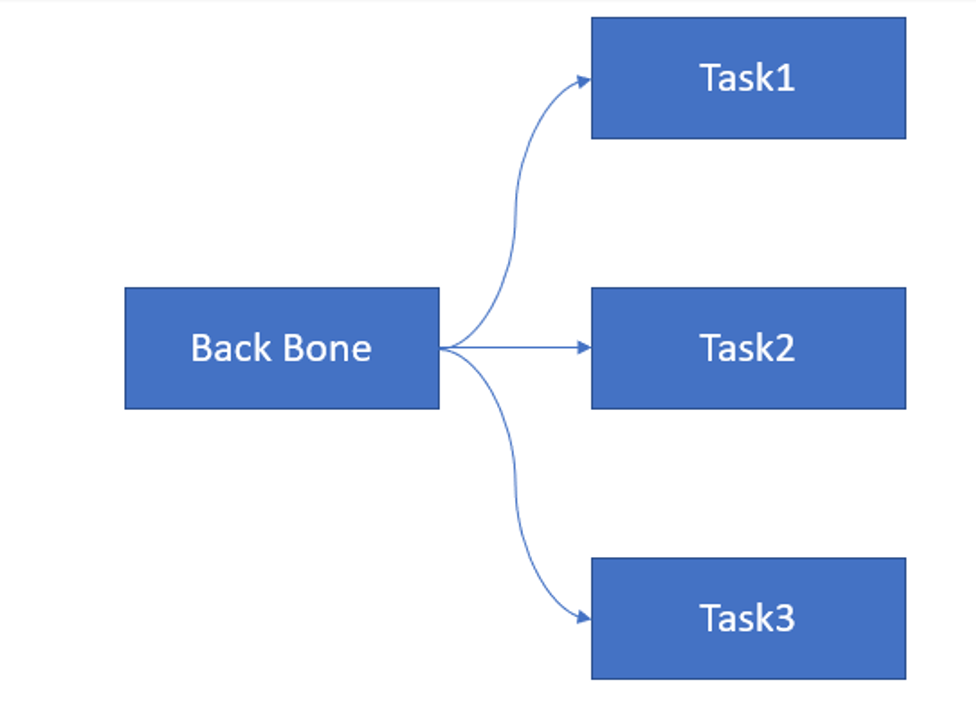

<!---This file is CONFIDENTIAL and created by Arm Technology (China) Co., Ltd.-->
<!---See the copyright file distributed with this work for additional information-->
<!---regarding copyright ownership.-->
# Compass Pipeline

**1. Pipeline Introductions**

Multi-task model is usually like this. One backbone and multi tasks do different
things which depends on backbone outputs.



As to multi-task model, for example YOLOP (https://github.com/hustvl/YOLOP),
an requirement is that to get one task output once it is ready instead of waiting for
all outputs are ready and getting them together.

In this situation, pipeline executor is suggested.
Users would assign how to split the origin model to multi models(Back Bone + Task1 + Task2 + Task3 in this case).
The Pipeline would organize the multi models according to their dependencies.
Automatically start different threads to run different task in pipeline executor,
so that users can get task1 output once it is ready and do some post-process
using CPU meanwhile AIPU continues running Task2 and Task3.


**2. Compiling and export a multi-task NN model**

To use pipeline module, users need to guarantee all parts of the entire model can run on AIPU, and also only model from onnx support pipeline spliting.
Here would make YOLOP as an example.
Pipeline compling would have the following process

1. users need to prepare the config file and construct AipuCompass object as original compass model.
```
    cfg = "onnx_yolop_pipeline.cfg"
    compass = AipuCompass(cfg)
```

2. users need to indicate how to split the model. In this step, users need to provides a list of dict.
```
    split_config = [
        {"inputs": ["images"], "outputs": ["Mul_359", "Mul_412", "Concat_415"]},
        {"inputs": ["Mul_359", "Mul_412", "Concat_415"], "outputs": ["Concat_799"]},  # det_out
        {"inputs": ["Concat_415"], "outputs": ["Sigmoid_924"]},  # drive_area_seg
        {"inputs": ["Concat_415"], "outputs": ["Sigmoid_1049"]},  # lane_line_seg
    ]
```

In this list, each dict indicate an submodule which is part of origin onnx model. <br>
The dict have 2 keys: “inputs” and “outputs”, each value is a list of string, the string is the name of the cutting point indicate the node name in original onnx model. <br>
As the example shows, the origin model would be splited into 4 submodules. <br>
The first submodule inputs is the origin onnx model “images” and it has 3 outputs which correspondence with 3 nodes “Mul_359”, “Mul_412”, “Concat_415” on the original onnx model. <br>
The following 3 submodules consumes the first submodule output and have their own outputs and they are indepentent with each other.

3. user need to construct CompassPipelineConfig and split it according to split_config
```
    config_obj = CompassPipelineConfig(compass)
    config_obj.split(split_config, ["Concat_799", "Sigmoid_924", "Sigmoid_1049"])
```
After prepare the split_config, user need to construct CompassPipelineConfig and split it according to split_config. <br>
The split API need another list input [“Concat_799”, “Sigmoid_924”, “Sigmoid_1049”]，which indicate the pipeline outputs.<br>
All tensor name in this list should appears in the split_config and its index in this list would be used in API get_output_by_index later.

4. prepare_build and build
```
    #config_obj.prepare_build(target = "llvm -mtriple=aarch64-linux-gnu", export_cc = "aarch64-linux-gnu-g++")
    config_obj.prepare_build(target = "llvm", export_cc = None)
    pipeline_mod_factory = config_obj.build()
```
Before call config_obj.build(), users need call prepare_build to set the target. The prepare_build needs 2 parameters, target and export_cc. <br>
If need cross_compile, the target need set mtriple and the export_cc is the cross_compile toolchain path. <br>
Otherwise target and export_cc setting to None means use host as target and default cc as compiler. <br>
After prepare_build, call build and would return a pipeline_module_factory object.

5. export the model
```
    out_dir = "deploy_pipeline"
    os.makedirs(out_dir, exist_ok=True)
    model_config_file = pipeline_mod_factory.export_library(out_dir)
```
The export_library would export all submodule files into one directory as well as the pipeline config file in it. <br>
The export_library return path and name of the configuration file(usually named as ${out_dir}/config), the configuration file contains the disk path of the parameter file, library file, and JSON file.


**3. C++ deployment**


We sugguest using C++ API to deploy the pipeline modules
```
  static auto load_lib_fn = tvm::runtime::Registry::Get("compass_pipeline.load");
  tvm::runtime::Module mod = (*load_lib_fn)(model_config_file);
  tvm::runtime::PackedFunc set_input = mod.GetFunction("set_input");
  tvm::runtime::PackedFunc get_output = mod.GetFunction("get_output_by_index");
  tvm::runtime::PackedFunc run = mod.GetFunction("run");
```


To deploy on device, first copy all the directory former exported to the device rootfs. And record the config file path ${out_dir}/config.
As to C++ code, get the registered global function “compass_pipeline.load”. <br>
After that, call it with model_config_file to construct tvm::runtime::Module object.<br>
We get some key function from the modules.

1. set_input

>This function accepts 2 parameters, first is string which indicate the parameter name in the pipeline and second is the ndarray.

2. get_output_by_index
>This function accepts 2 parameters, first is int which indicate the index of the pipeline output, the index is the list of output when call split mentioned former. And the >second parameter interval_microseconds is int which is the sleep microseconds when the result not ready.
>This is an blocking API if second parameter > 0, it will return until the specified output is ready. If the output is not ready, the thread would sleep for >interval_microseconds and try get result again. <br>
>If interval_microseconds <= 0, this interface is non-blocking and return empty ndarray if result is not ready.

3. run
>This function has no parameters, which means start the pipeline.

>Users should set_input for all inputs and call run to start the pipeline.
>After That, call get_output_by_index to get all outputs.


**4. Example**

Arm China provides an example of  pipeline compile and deployment.You can check the following files: <br>

```
out-of-box-test/onnx_yolop_pipeline/README for the yolop_pipeline detailed introduction.
out-of-box-test/onnx_yolop_pipeline/yolop_pipeline_test.py for the demo compile and export.
out-of-box-test/tf_resnet_50/deploy/pipeline_deploy.cc for how to use the C++ API in APP.
```
You can see the out-of-the-box use case in the delivered software package for the complete example.
