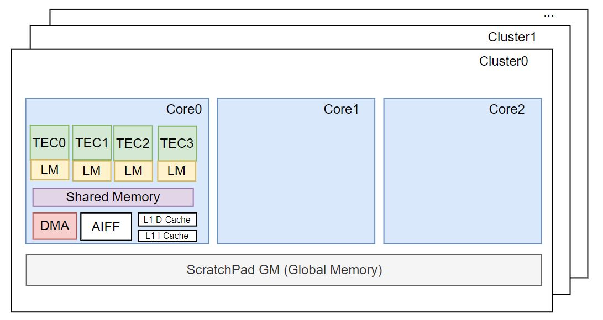
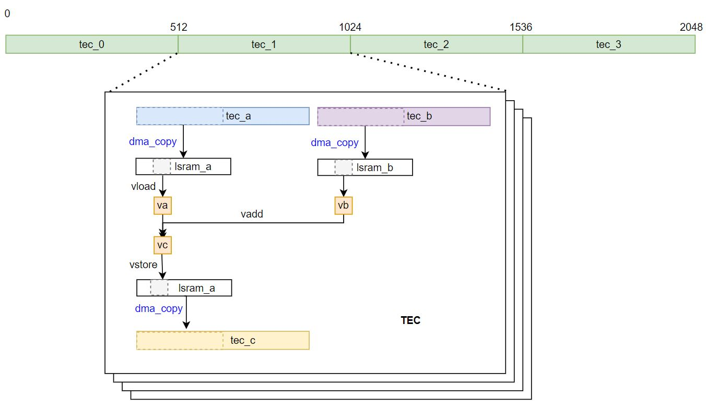

<!---SPDX-License-Identifier: Apache-2.0-->
<!---Copyright (c) 2023-2024 Arm Technology (China) Co. Ltd.-->

# Zhouyi NPU Architecture

For a better understanding of Compass DSL programming, it is recommended to have a basic understanding of the Zhouyi NPU architecture. This article will give an overview of the Zhouyi NPU architecture. For more information, please refer to the Zhouyi NPU Technical Reference Manual.

## Key Concept
The Zhouyi NPU introduces an extensible **multi-cluster** and **multi-core** architecture.

### Cluster
The Zhouyi NPU can be configured as multiple clusters. Each cluster may include multiple cores for
different tasks execution in parallel.

- **Global Memory** (GM) works as scratchpad memory for all NPU cores inside a cluster.

### Core
Each cluster can be configured as a single core or multiple cores.

- **Shared memory** works for all TECs inside a core. Shared memory has a fixed address entry for all TECs and asynchronized units to access.
- **AIFF** works as a major fixed operation accelerated data processing unit. AIFF can accept different requests from TECs and return execution results and status to each TEC.
- **L1 D-Cache** is the shared data cache for all TECs inside a core. It enables multiple TECs to fetch data at the same time, and it also supports AIFF/DMA instruction dispatch.
- **L1 I-Cache** is the instruction cache unit. It fetches instructions for the fetch unit. It enables multiple TECs to fetch requests at the same time and returns instructions to the fetch unit. The instructions are from either I-Cache memory or external memory.
- **Direct Memory Access (DMA)**: Each TEC has a dedicated DMA channel to send requests from the TEC to the DMA unit. The DMA unit is responsible for data movement across different memory space. DMA accepts different requests from TECs and returns execution results and status to each TEC.

### TEC
A TEC acts as an independent programmable unit for data processing and flow control.

- **Local Memory (LM)**: Each TEC has internal local memory which is only accessible by each TEC.
- **Scalar Processing Unit (SPU)**: For scalar computing and control-flow.
- **Vector/Tensor Processing Engine (VPE)**: For vector/tensor processing.
- **Floating-point Processing Unit (FPU)**: For scalar and vector floating-point computing.

## Compass DSL Programming Model
The Compass DSL programming is inside the core level for multiple TECs. Tasks scheduling on multi-cluster and multi-core is not the scope of Compass DSL.

Compass DSL follows the OpenCL <strong>data parallel programing model</strong>. The operator primfunc defined by Compass DSL will generate an OpenCL kernel function.

### Addition example
Suppose we want to compute `c[2048] = a[2048] + b[2048]`.

The 2048 elements will be split into 4 parts for 4 TECs. TEC_0 processes the first 512 elements and TEC_1, TEC_2, and TEC_3 process its own data segments with 512 elements. Note that the 4 TECs execute the same kernel code instructions.

## Reference
- Arm China Zhouyi NPU Technical Reference Manual
- Arm China Zhouyi Compass OpenCL Programming Guide
